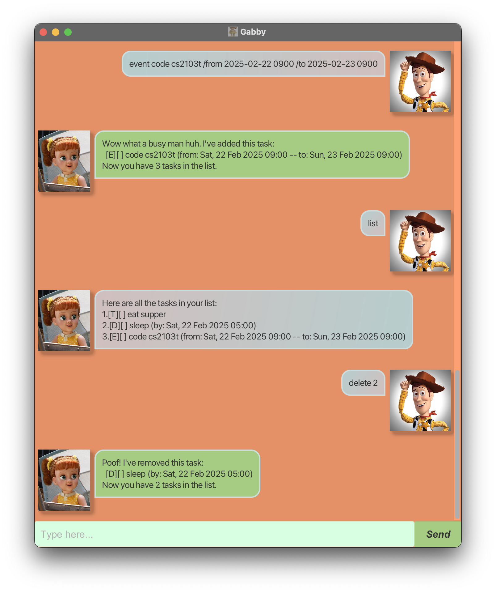

# Gabby User Guide



Welcome to Gabby – the ultimate task management tool designed to effortlessly keep track of your work. Whether you’re managing personal projects or professional responsibilities, Gabby’s intuitive CLI and GUI interfaces will help you stay on top of your tasks.

This guide will help you navigate the essential features, so you can make the most of Gabby and enjoy a more organised, efficient day.


## Adding a todo task: `todo`

Adds a task with a description.

### Usage
```
todo <description>
```

### Example
```
todo eat supper
```

### Expected Output
```
Wow what a busy man huh. I've added this task:
  [T][ ] eat supper
Now you have 1 task in the list.
```

## Adding a deadline task: `deadline`

Adds a task with a description and an end datetime.

### Usage
```
deadline <description> /by <datetime>
```
- `datetime` should be in the format `yyyy-mm-dd hhmm`

### Example
```
deadline sleep /by 2025-02-22 0500
```

### Expected output
```
Wow what a busy man huh. I've added this task:
  [D][ ] sleep (by: Sat, 22 Feb 2025 05:00)
Now you have 2 tasks in the list.
```

## Adding an event task: `event`

Adds a task with a description, and a start and end datetime.

### Usage
```
event <description> /from <datetime> /to <datetime>
```
- `datetime` should be in the format `yyyy-mm-dd hhmm`

### Example
```
event code cs2103t /from 2025-02-22 0900 /to 2025-02-23 0900
```

### Expected output
```
Wow what a busy man huh. I've added this task:
  [E][ ] code cs2103t (from: Sat, 22 Feb 2025 09:00 -- to: Sun, 23 Feb 2025 09:00)
Now you have 3 tasks in the list.
```

## Marking a task: `mark`

Marks a task as done.

### Usage
```
mark <task ID>
```
- The `task ID` refers to the index number shown when displaying all tasks. `task ID` must be a positive integer.

### Example
```
mark 1
```

### Expected output
```
Great job! I've marked this task as done:
  [T][X] eat supper
```

## Unmarking a task: `unmark`

Marks a task as undone.

### Usage
```
unmark <task ID>
```
- The `task ID` refers to the index number shown when displaying all tasks. `task ID` must be a positive integer.

### Example
```
unmark 1
```

### Expected output
```
Sure! I've marked this task as not done yet:
  [T][ ] eat supper
```

## Listing tasks: `list`

Lists all tasks. If date is provided, lists tasks on that date.

### Usage
```
list [date]
```
- `date` is optional and should be in the format `yyyy-mm-dd`

### Example
```
list 2025-02-22
```

### Expected output
```
Here are the tasks in your list on 2025-02-22:
1.[D][ ] sleep (by: Sat, 22 Feb 2025 05:00)
2.[E][ ] code cs2103t (from: Sat, 22 Feb 2025 09:00 -- to: Sun, 23 Feb 2025 09:00)
```

## Deleting a task: `delete`

Deletes a task.

### Usage
```
delete <task ID>
```
- The `task ID` refers to the index number shown when displaying all tasks. `task ID` must be a positive integer.

### Example
```
delete 2
```

### Expected output
```
Poof! I've removed this task:
  [D][ ] sleep (by: Sat, 22 Feb 2025 05:00)
Now you have 2 tasks in the list.
```

## Finding a task: `find`

Finds tasks by a keyword in the description.

### Usage
```
find <keyword>
```

### Example
```
find 2103
```

### Expected output
```
Here are the matching tasks in your list:
1.[E][ ] code cs2103t (from: Sat, 22 Feb 2025 09:00 -- to: Sun, 23 Feb 2025 09:00)
```

## Showing help message: `help`

Shows a message of all the accepted commands.

### Usage
```
help
```

### Expected output
```
Here are the commands you can use:
- `list [date]`: Lists all tasks. If date is provided, lists tasks on that date.
- `todo <description>`: Adds a todo task.
- `deadline <description> /by <datetime>`: Adds a deadline task.
- `event <description> /from <datetime> /to <datetime>`: Adds an event task.
- `mark <task ID>`: Marks a task as done.
- `unmark <task ID>`: Marks a task as not done.
- `delete <task ID>`: Deletes a task.
- `find <keyword>`: Finds tasks by a keyword in the description.
- `help`: Shows this help message.
- `bye`: Exits the program.
```

## Exiting the program: `bye`

Exits the program.

### Usage
```
bye
```
